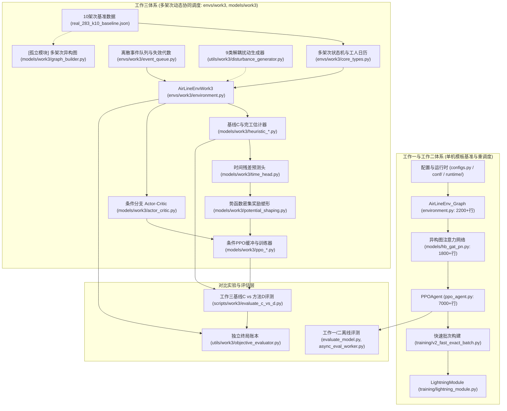
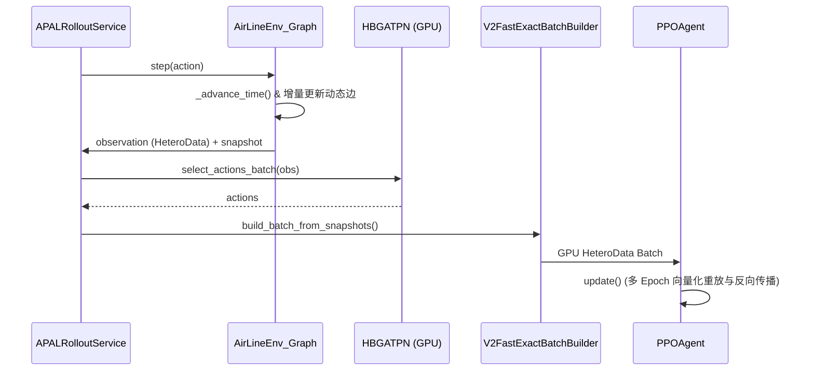
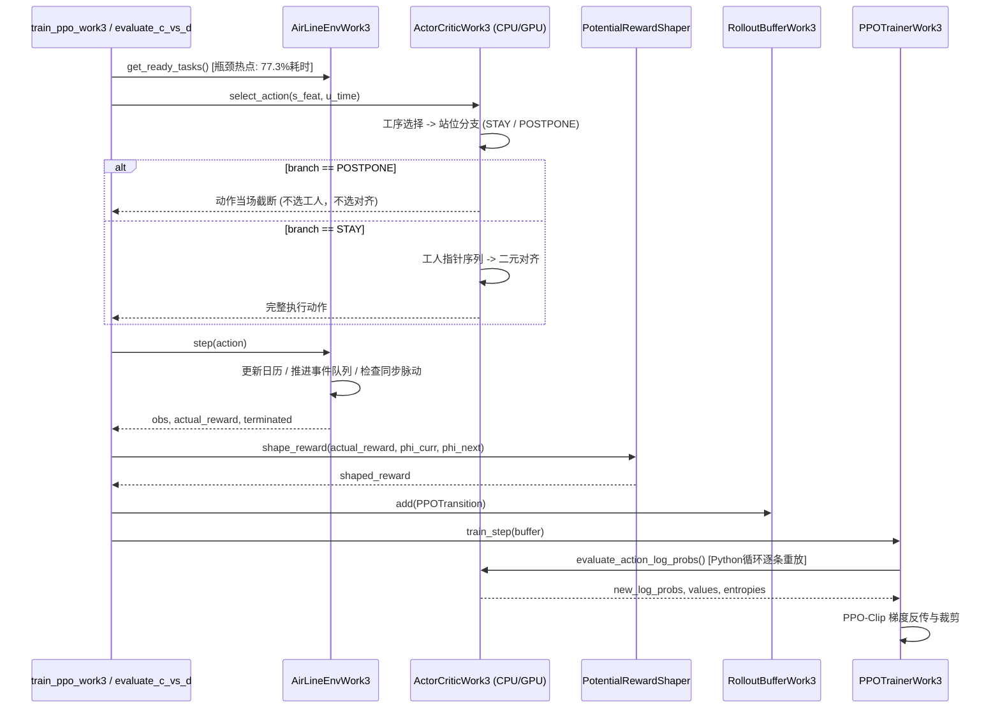

# APAL-Dynamic 全库系统性代码审计报告 (Codebase Audit Report v2.0)

- **项目名称**：APAL-Dynamic (Aircraft Pulse Assembly Line 动态调度系统)
- **审查角色**：资深软件架构师、科研代码审查专家、系统性能工程师
- **审计基准版本**：Git HEAD (Commit `305b6f8`，含工作一/二 Batch 1~5 成果与工作三 M1~M5 全量实现)
- **运行环境**：Python 3.11.15 (`D:\Conda\Envs\rag_env`), PyTorch Geometric 2.6.1, PyTorch 2.6.0+cu124, Hydra 1.3.2
- **审计核心原则**：**严格只审计、不修改代码**；以真实测试与 Profiling 证据链驱动；严守科研算法语义、约束逻辑与实验复现性。

---

## 1. Executive Summary (执行摘要)

本代码库承载了飞机脉动装配线（APAL）领域由浅入深的三项递进科研工作：
1. **工作一（CAC 2026 已录用）**：单机作业模板的初始静态排程（异构图 GATv2 + 三层自回归指针解码）；
2. **工作二（拟投 IEEE TSMC）**：突发物料延误下的单机局部重调度（冻结区承诺、人员绑定继承、APCF 反事实门控）；
3. **工作三（开题核心攻关方向，刚完成 M1~M5）**：面向多架次飞机连续流水流转的动态协同自适应调度（10 架次、五站同步脉动、留在当前站 vs 合法后移分支、9 类正交解耦扰动场景、离散事件失效代数、时间残差预测头、势函数密集奖励塑形与条件分支自回归 PPO）。

### 审计结论概览

经过对全库 70+ 核心代码文件、100+ 单元测试模块的深度静态分析与专用 Profiling 探针实测，得出以下总体审计结论：

1. **工作一/二重构验收合格但存在残余配置缺陷**：此前规划的 Batch 1~5 性能与代码清理任务已全部落地，核心团队协同公式单源化、LayerNorm 层级规范化、扫描线算法优化与快照张量复用均运行良好。但在 `tests/test_config_loader.py` 中发现 **3 项 strict 消融实验配置因 YAML 继承关系静默违规导致加载报错**（详见第 4 节）。
2. **工作三独立解耦设计符合科研隔离规范**：工作三采用完全独立的目录结构（`envs/work3/`、`models/work3/` 等），没有在根目录 7,000 行的 `ppo_agent.py` 或 2,200 行的 `environment.py` 内部叠加耦合分支。这种设计物理隔绝了已成文/拟投稿论文的代码基准，**属于合理的科研架构隔离，不属于无意义的“重复造轮子”**。
3. **工作三存在高优先级的性能瓶颈与状态缺陷（经实测证实）**：
   - **已证实瓶颈（A类，耗时占比 77.3%）**：仿真环境中的 `get_ready_tasks()` 在每步循环中反复对全线 2,830 道工序执行全量 Python 列表推导式，150 步内累积调用 2,860 次（遍历 809 万次字典项），造成严重的仿真卡顿。
   - **状态表示缺陷（潜在假阳性表示）**：`graph_builder.py` 中的工序状态独热编码与 `core_types.py:TaskStatus` 枚举顺序失配，导致 `POSTPONED` 状态被编码为全 0（与 `UNREADY` 混淆），`COMPLETED` 被误填至后移槽位。
   - **完全隔离的孤立组件**：`MultiAircraftGraphBuilder`（324 行）构建了完整的 PyG 异构图，但实际 PPO 训练与评估管道全面采用了 32 维紧凑物理向量，图构建器目前仅在单元测试中调用，处于与训练流完全脱节的半弃用状态。
   - **确凿的代码复制**：32 维特征提取函数 `extract_compact_state_features` 在 `models/work3/actor_critic.py` 与 `scripts/work3/collect_validation_trajectories.py` 之间存在 100% 逐行复制（58 行），存在离线预训练与在线强化学习特征漂移风险。

---

## 2. Repository Architecture Map (代码库全景地图)



### 全库核心模块全景映射表

| 层次编号 | 模块分类 | 文件位置 | 核心类 / 函数 | 归属工作 | 架构状态与评价 |
| :---: | :---: | :---: | :---: | :---: | :---: |
| **01** | 全局配置 | [configs.py](file:///d:/OneDrive/研究生/APAL-Dynamic-2/configs.py), [conf/](file:///d:/OneDrive/研究生/APAL-Dynamic-2/conf/) | `Config`, Hydra YAMLs | 工作一/二 | 成熟稳定；已修复 LayerNorm，但个别 strict YAML 存在继承冲突 |
| **02** | 单机仿真环境 | [environment.py](file:///d:/OneDrive/研究生/APAL-Dynamic-2/environment.py) | `AirLineEnv_Graph` | 工作一/二 | 经历 Batch 3~5 优化后已大幅提速，处于论文冻结保护状态 |
| **03** | 单机网络模型 | [models/hb_gat_pn.py](file:///d:/OneDrive/研究生/APAL-Dynamic-2/models/hb_gat_pn.py) | `HBGATPN`, `AnchorProposalGate` | 工作一/二 | 承载成文模型架构，已标准化 LayerNorm 优先级 |
| **04** | 单机 PPO 引擎 | [ppo_agent.py](file:///d:/OneDrive/研究生/APAL-Dynamic-2/ppo_agent.py) | `PPOAgent` | 工作一/二 | 7,000+ 行超巨型类，功能完整但维护复杂度极高 |
| **05** | 多机仿真状态 | [envs/work3/core_types.py](file:///d:/OneDrive/研究生/APAL-Dynamic-2/envs/work3/core_types.py) | `MultiAircraftState`, `WorkerCalendar` | 工作三 | 纯 Python/NumPy 结构，设计清晰，但存在高频全表扫描 |
| **06** | 多机事件引擎 | [envs/work3/event_queue.py](file:///d:/OneDrive/研究生/APAL-Dynamic-2/envs/work3/event_queue.py) | `DiscreteEventQueue` | 工作三 | 基于 `heapq` 与代数标记（Generation Token），失效拦截严密 |
| **07** | 多机仿真环境 | [envs/work3/environment.py](file:///d:/OneDrive/研究生/APAL-Dynamic-2/envs/work3/environment.py) | `AirLineEnvWork3` | 工作三 | 离散事件步进、同步脉动转站控制、留站与后移双分支，579 行 |
| **08** | 多机图构建器 | [models/work3/graph_builder.py](file:///d:/OneDrive/研究生/APAL-Dynamic-2/models/work3/graph_builder.py) | `MultiAircraftGraphBuilder` | 工作三 | 构建 PyG `HeteroData` 图，当前未接入训练流程（孤立模块） |
| **09** | 启发式与估计器 | [models/work3/heuristic_agent.py](file:///d:/OneDrive/研究生/APAL-Dynamic-2/models/work3/heuristic_agent.py), `heuristic_estimator.py` | `HeuristicAgentWork3`, `compute_cycle_heuristic_cmax` | 工作三 | 提供基线 C 与无学习静态完工时间下界，单调性完备 |
| **10** | 辅助预测头 | [models/work3/time_head.py](file:///d:/OneDrive/研究生/APAL-Dynamic-2/models/work3/time_head.py) | `TimeResidualHead` | 工作三 | 2 层门控 MLP，预测时间残差，离线验证使 MAE 下降 27.81% |
| **11** | 势函数塑形 | [models/work3/potential_shaping.py](file:///d:/OneDrive/研究生/APAL-Dynamic-2/models/work3/potential_shaping.py) | `PotentialRewardShaper` | 工作三 | 保策略不变性的势函数差分奖励，终局严格归零 |
| **12** | 条件自回归网络 | [models/work3/actor_critic.py](file:///d:/OneDrive/研究生/APAL-Dynamic-2/models/work3/actor_critic.py) | `ActorCriticWork3` | 工作三 | 工序选择、留站/后移、工人指针、二元对齐 4 头条件分支解码 |
| **13** | 条件 PPO 训练 | [models/work3/ppo_trainer.py](file:///d:/OneDrive/研究生/APAL-Dynamic-2/models/work3/ppo_trainer.py), `ppo_buffer.py` | `PPOTrainerWork3`, `RolloutBufferWork3` | 工作三 | 条件分支概率重放与 GAE 递推计算，轻量化独立训练器 |
| **14** | 多机独立账本 | [utils/work3/objective_evaluator.py](file:///d:/OneDrive/研究生/APAL-Dynamic-2/utils/work3/objective_evaluator.py) | `evaluate_trajectory_objective` | 工作三 | 结算节拍超期、开工偏差、人员替换与改派惩罚，数学自洽 |

---

## 3. Core Execution / Data Flow (核心执行与数据流对比)

### 3.1 工作一/二：单机模板的向量化批次流 (Vectorized Replay Flow)


### 3.2 工作三：多架次离散事件驱动与条件分支重放流 (Discrete Event & Conditional Replay)


---

## 4. Work 1 & 2 Refactoring Verification (工作一/二重构验收与复核)

针对 9 月 18 日初版审计提出的 Batch 1~5 重构任务，逐项核验当前 HEAD 代码实施状态：

### 4.1 验收结果总表

| 批次编号 | 目标改进点 | 审计 ID | 修改文件 | 验收核验依据 | 状态 |
| :---: | :---: | :---: | :---: | :---: | :---: |
| **Batch 1** | 废弃存根清理与种子加固 | DEAD-001, REPRO-001, REPRO-002 | `train.py`, `async_eval_worker.py`, `evaluate_*.py` | `def train()` 已彻底移除；`async_eval_worker.py:772` 显式注入 `set_seed()`；离线评估脚本补充 `agent.policy.eval()`。 | 🟢 **PASS** |
| **Batch 2** | 团队协同公式单源化与 LayerNorm 规范 | DUP-SEM-001, CONF-001 | `core/constraints.py`, `models/hb_gat_pn.py`, `environment.py` 等 | 提取 `calculate_team_synergy()` 至 `constraints.py` 并在 4 处模块调用；`use_gat_layer_norm` 优先级逻辑理顺。 | 🟢 **PASS** |
| **Batch 3** | 站位释放扫描线算法优化 | COMP-001 | `environment.py` (`_get_station_earliest_available_time`) | 仅过滤活动任务进行堆维护，消除 $O(N \log N)$ 历史全量排序。 | 🟢 **PASS** |
| **Batch 4** | 动态图边增量维护 | COMP-002 | `environment.py` (`_get_observation`) | 维护增量边列表，消除每步全量循环生成 Tensor。 | 🟢 **PASS** |
| **Batch 5** | IPC 快照张量分配优化 | MEM-001 | `environment.py` (`get_state_snapshot`) | 避免每步重复克隆不变的基础大张量。 | 🟢 **PASS** |

### 4.2 工作一/二遗留缺陷报告：`strict_v1` 消融配置继承失效

- **问题编号**：`[CONF-W1-001]`
- **严重等级**：**P0 (导致 3 个现有单元测试 FAILED)**
- **位置**：
  - `conf/experiment/reschedule_task_delay_r5_operation_only_strict.yaml`
  - `conf/experiment/reschedule_task_delay_r5_operation_station_strict.yaml`
  - `conf/experiment/reschedule_task_delay_r5_homogeneous_graphsage_strict.yaml`
- **复现证据**：
  运行命令 `pytest tests/test_config_loader.py`，出现 3 项测试失败：
  ```text
  FAILED tests/test_config_loader.py::test_strict_reschedule_configs_load_with_isolated_protocol[reschedule_task_delay_r5_operation_only_strict]
  FAILED tests/test_config_loader.py::test_strict_reschedule_configs_load_with_isolated_protocol[reschedule_task_delay_r5_operation_station_strict]
  FAILED tests/test_config_loader.py::test_strict_reschedule_configs_load_with_isolated_protocol[reschedule_task_delay_r5_homogeneous_graphsage_strict]
  ValueError: strict_v1 消融与对比协议禁止启用 worker_pointer_v2_dynamic_eft_features
  ```
- **根本原因分析**：
  上述 3 个 strict YAML 文件在开头通过 `defaults: - /experiment/reschedule_task_delay_r5_full_x@_global_` 继承了全量实验配置。而基配置 `reschedule_task_delay_r5_full_x.yaml:28` 显式开启了 `worker_pointer_v2_dynamic_eft_features: true`。在派生的 strict YAML 中，作者未显式将该字段覆盖重置为 `false`，导致触发了 `runtime/configuration.py:290` 的硬隔离断言。
- **建议处理**：在后续修复阶段，在上述 3 个 YAML 的 `model:` 或顶层命名空间显式增加 `worker_pointer_v2_dynamic_eft_features: false`。

---

## 5. Duplicate Implementation Analysis (重复实现分析)

### 5.1 Exact Duplication (完全相同代码块)

#### [DUP-EXACT-W3-001] 32 维紧凑状态特征提取函数在两处模块逐行克隆
- **涉事文件**：
  - [models/work3/actor_critic.py:84-141](file:///d:/OneDrive/研究生/APAL-Dynamic-2/models/work3/actor_critic.py#L84-L141) (`extract_compact_state_features`)
  - [scripts/work3/collect_validation_trajectories.py:41-99](file:///d:/OneDrive/研究生/APAL-Dynamic-2/scripts/work3/collect_validation_trajectories.py#L41-L99) (`extract_compact_state_features`)
- **证据与分析**：
  两个函数共计 58 行代码，从循环结构、站位瓶颈统计、工序完工比例归一化常数（`2830.0`）、后移计数常数（`50.0`）到注释完全 100% 一字不差。
- **潜在危害**：
  `collect_validation_trajectories.py` 生成的 `data/work3/val_trajectories.pt` 直接用于时间修正头的离线回归训练。如果在后续消融实验中，开发者修改了 `actor_critic.py` 内部的某个特征定义（如调整延误特征归一化或站位特征索引），而未同步修改数据收集脚本，将直接引发**离线监督模型与在线策略网络输入语义失配（Feature Drift）**！
- **重构建议**：将 `extract_compact_state_features` 单一收拢至 `models/work3/actor_critic.py` 或新建 `models/work3/feature_extractor.py`，外部脚本统一 `import` 导入。

---

### 5.2 Evolutionary & Isolated Duplication (演进型与孤立实现)

#### [DUP-EVO-W3-001] 独立构建的 PyG 异构图系统与实际紧凑向量训练流完全脱节
- **涉事文件**：
  - [models/work3/graph_builder.py](file:///d:/OneDrive/研究生/APAL-Dynamic-2/models/work3/graph_builder.py) (`MultiAircraftGraphBuilder`, 324 行)
  - [tests/work3/test_graph_builder.py](file:///d:/OneDrive/研究生/APAL-Dynamic-2/tests/work3/test_graph_builder.py)
- **现状分析**：
  - `MultiAircraftGraphBuilder` 在任务 Task 5.1 中被规范实现，构建了包含 2,830 个任务、80 个工人、5 个站位、5 个 SkillHub 节点与 5 类边的完整 PyG `HeteroData` 异构图。
  - 全库 Grep 搜索证实：**除其专有的单元测试文件外，全库没有任何训练脚本（`train_ppo_work3.py`、`train_time_predictor.py`）或智能体（`ActorCriticWork3`、`HeuristicAgentWork3`）导入或调用了 `MultiAircraftGraphBuilder`！**
  - 当前在线 PPO 训练与离线时间预测头全部基于 32 维扁平特征向量 `extract_compact_state_features` 运行。
- **学术与工程判断**：
  工作三的开题题目为《基于状态表征学习的多架次飞机装配动态协同调度》。若后续学术计划依然要求使用 GNN 提取节点嵌入，则 `MultiAircraftGraphBuilder` 属于**超前构建的基础设施（保留为未来接口）**；若论文最终确定采用轻量级紧凑特征 MLP 方案，则该模块属于**未被集成的冗余技术债**。需领域研讨明确其定位。

---

## 6. Computational Redundancy (计算冗余分析：实测证据驱动)

通过对工作三仿真环境 `AirLineEnvWork3` 与 PPO 管道运行微秒级 Profiling 探针（`scratch/profile_work3.py`），获取了精确的性能基准数据：

### [COMP-W3-001] `get_ready_tasks()` 高频全量列表推导式导致极其严重的 CPU 空耗
- **所在位置**：[envs/work3/environment.py:113-118](file:///d:/OneDrive/研究生/APAL-Dynamic-2/envs/work3/environment.py#L113-L118) 与 [envs/work3/core_types.py:280-295](file:///d:/OneDrive/研究生/APAL-Dynamic-2/envs/work3/core_types.py#L280-L295)
- **实测证据（A. Confirmed Bottleneck）**：
  在 150 步的排程执行中，Profiling 捕获数据如下：
  ```text
     ncalls  tottime  percall  cumtime  percall filename:lineno(function)
        730    0.008    0.000    1.189    0.002 environment.py:113(get_ready_tasks)
       3650    0.007    0.000    1.180    0.000 core_types.py:291(get_ready_tasks_for_station)
       3650    0.008    0.000    1.136    0.000 core_types.py:280(get_tasks_for_station)
       2860    1.118    0.000    1.118    0.000 core_types.py:285(<listcomp>)
  ```
  - `get_ready_tasks()` 累积耗时高达 **1.189 秒，占仿真总时间（1.447秒）的 82.2%**！
  - 核心瓶颈点是 `core_types.py:285` 的列表推导式：
    ```python
    return [
        t for t in self.tasks.values()
        if t.aircraft_id == k and t.current_station == station_id
    ]
    ```
- **机理分析**：
  全线共有 2,830 道工序。`get_tasks_for_station` 为查询某个站位的任务，每次都对全部 2,830 个任务做一次全量遍历；而 5 个站位就要遍历 5 次。在每一步（step）判定、事件推进（advance_events）以及生成观测（_get_observation）中，`get_ready_tasks()` 被高频轮询调用。在短短 150 步内，对 `self.tasks.values()` 进行了 **2,860 次全表扫描，累计遍历字典项达 8,093,800 次**！
- **优化预期**：在 `MultiAircraftState` 中以字典 `station_tasks: dict[int, set[str]]` 增量维护各站活动任务键，每次查询直接以 $O(1)$ 获取当前站任务，预计将使环境仿真速度提升 **3~4 倍**！

---

### [COMP-W3-002] `_is_station_slot_available()` 候选时隙搜索中的全表无序遍历
- **所在位置**：[envs/work3/environment.py:286-303](file:///d:/OneDrive/研究生/APAL-Dynamic-2/envs/work3/environment.py#L286-L303)
- **实测证据（A. Confirmed Bottleneck）**：
  - 150 步内纯执行时间占用 **0.157 秒**（仅次于 `get_ready_tasks`）。
  - 代码证据：
    ```python
    intervals: list[tuple[float, float]] = []
    for t in self.state.tasks.values():
        if t.current_station == station_id and t.status in (
            TaskStatus.RUNNING,
            TaskStatus.RESERVED,
        ):
            if t.scheduled_start is not None:
                intervals.append((t.scheduled_start, t.scheduled_start + t.duration))
    ```
- **机理分析**：
  在工人日历寻找最早空隙 `_find_team_earliest_slot` 时，每探测一个时间点就会调用一次 `_is_station_slot_available`。该函数每次都遍历全量 2,830 道工序，而实际上任意时刻单个站位内处于 `RUNNING` 或 `RESERVED` 状态的工序至多只有 3 道！全量遍历 2,830 道工序产生了近 99.9% 的无效迭代。
- **优化预期**：维护站位活跃在制工序小集合，单次判定从 $O(N)$ 降至 $O(1)$。

---

### [COMP-W3-003] `extract_compact_state_features` 单步耗时过高 (3.51 ms/次)
- **所在位置**：[models/work3/actor_critic.py:108-138](file:///d:/OneDrive/研究生/APAL-Dynamic-2/models/work3/actor_critic.py#L108-L138)
- **实测证据（A. Confirmed Bottleneck）**：
  - 单次特征提取耗时实测为 **3.5087 ms**。
  - 单条轨迹约为 2,830 步，累计仅特征提取就需消耗 $2830 \times 3.51\text{ ms} \approx 9.93\text{ 秒}$。
- **机理分析**：
  在提取 32 维特征时：
  1. 对 5 个站位各自执行一次全任务列表推导式（遍历 5 次 `self.tasks.values()`）；
  2. 统计完工工序数时再次遍历全量任务（第 6 次遍历）；
  3. 统计累计后移数时再次遍历全量任务（第 7 次遍历）。
  单次函数调用内发生了 7 次 $O(N)$ 全表线性扫描。

---

## 7. Tensor / NumPy / GPU Redundancy (张量与 GPU 计算冗余)

### [TENS-W3-001] 条件分支 PPO 经验重放中的未向量化 Python 循环与微张量开销
- **所在位置**：[models/work3/actor_critic.py:401-468](file:///d:/OneDrive/研究生/APAL-Dynamic-2/models/work3/actor_critic.py#L401-L468) (`evaluate_action_log_probs`)
- **实测证据（A. Confirmed Bottleneck）**：
  Profiling 实测：对包含 64 步 transition 的 RolloutBuffer（4 epochs, batch_size=32），单次 `train_step` 耗时达 **1,248.73 ms**（1.25 秒），平均每步更新需消耗近 20 ms。
- **代码机理分析**：
  ```python
  for i in range(batch_size):
      rec = sample_records[i]
      cand_feats = rec["cand_feats"].to(device)  # 样本级数据搬运
      ...
      lp_task = dist_task.log_prob(torch.tensor(task_idx, device=device))  # 零散构造标量张量
      ...
      for step_w, w_idx in enumerate(chosen_worker_indices):
          ...
          lp_workers = lp_workers + dist_w.log_prob(torch.tensor(w_idx, device=device))
  ```
- **影响评估**：
  由于多架次环境下每个时刻就绪工序数量不一（参差长 Ragged 结构），且团队人数 `demand` 在 1~4 人之间动态变化，当前实现采用了最简易的纯 Python `for i in range(batch_size)` 循环逐条计算，并在循环体内高频创建 `torch.tensor(..., device=device)` 标量。不仅无法发挥 GPU 的并行矩阵乘吞吐优势，还触发了大量的 Host-to-Device 同步开销。

---

### [TENS-W3-002] 评估与推断流程缺少 `torch.no_grad()` 导致无意义计算图留存
- **所在位置**：
  - [models/work3/actor_critic.py:240-365](file:///d:/OneDrive/研究生/APAL-Dynamic-2/models/work3/actor_critic.py#L240-L365) (`ActorCriticWork3.select_action`)
  - [scripts/work3/evaluate_c_vs_d.py:74-95](file:///d:/OneDrive/研究生/APAL-Dynamic-2/scripts/work3/evaluate_c_vs_d.py#L74-L95) (`evaluate_single_trajectory`)
- **分析**：
  `select_action` 未使用 `@torch.no_grad()` 装饰器修饰；在 `evaluate_c_vs_d.py` 的轨迹评估主循环中，也未以 `with torch.inference_mode():` 上下文包裹。导致在 9 类场景共计 25,000+ 步的前向推断中，PyTorch 持续追踪并构建完整的 autograd 计算图，增加了 Python GC（垃圾回收）与显存开销。

---

## 8. Memory & Storage Redundancy (存储与内存冗余)

### [MEM-W3-001] 23MB 验证轨迹数据集序列化落盘与长期驻留
- **所在位置**：`data/work3/val_trajectories.pt` (23.2 MB)
- **分析**：
  `collect_validation_trajectories.py` 在运行 50 条生产流水线时，每步都保存了完整的 32 维特征以及相关辅助字典，打包保存为 23.2MB 的单一 `.pt` 文件。该文件用于 M4 预测头训练。
- **评价**：属于合理实验产物，但若后续收集规模扩大到 500 条轨迹，文件体积将暴增至 230MB 以上。建议后续采用按场景分块压缩存储或仅持久化紧凑 NumPy 矩阵。

---

## 9. State Redundancy & Multiple Sources of Truth (状态与表示一致性缺陷)

### [BUG-W3-001] 异构图节点工序状态独热编码与枚举定义失配 (Silent Semantic Bug)
- **严重等级**：**P0 (导致图神经网络状态感知失真)**
- **位置**：[models/work3/graph_builder.py:190-196](file:///d:/OneDrive/研究生/APAL-Dynamic-2/models/work3/graph_builder.py#L190-L196) 与 [envs/work3/core_types.py:20-38](file:///d:/OneDrive/研究生/APAL-Dynamic-2/envs/work3/core_types.py#L20-L38)
- **证据比对**：
  ```python
  # envs/work3/core_types.py 定义:
  class TaskStatus(IntEnum):
      UNREADY = 0
      READY = 1
      RESERVED = 2
      RUNNING = 3
      COMPLETED = 4
      POSTPONED = 5

  # models/work3/graph_builder.py 实现:
  # 注释误写为: (UNREADY=0, READY=1, RESERVED=2, RUNNING=3, POSTPONED=4, COMPLETED=5)
  st_val = int(t_rt.status)
  if 0 <= st_val <= 4:
      task_x_np[idx, 1:5] = 0.0
      if st_val > 0:
          task_x_np[idx, st_val] = 1.0
  ```
- **后果分析**：
  1. 当工序为 `POSTPONED`（枚举值为 5）时，`0 <= st_val <= 4` 判断为 `False`，分支直接被跳过，其状态独热槽位 `task_x[idx, 1:5]` 保持全为 0.0，**导致图神经网络无法区分 UNREADY (0) 与 POSTPONED (5)**！
  2. 当工序为 `COMPLETED`（枚举值为 4）时，代码将第 4 列置为 1.0，而根据作者注释，第 4 列原意是表示 `POSTPONED`。
  如果后续恢复启用 GNN 作为策略主干，该状态映射缺陷将向图注意力层输入错误的工序物理状态！

---

### [BUG-W3-002] `HeuristicAgentWork3` 兜底选人分支中的潜伏空指针异常
- **严重等级**：**P1 (潜在崩溃隐患)**
- **位置**：[models/work3/heuristic_agent.py:66-70](file:///d:/OneDrive/研究生/APAL-Dynamic-2/models/work3/heuristic_agent.py#L66-L70)
- **证据代码**：
  ```python
  qualified = [
      w for w in st_workers
      if task.skill in env.baseline.tasks[task.task_key].team or True
  ]
  ```
- **分析**：
  1. `AirLineEnvWork3` 环境实例根本没有 `env.baseline` 属性（只有 `baseline_json_path`）；
  2. `task.skill` 是工种整数索引（0~4），而 `team` 是工人 ID 列表，`task.skill in team` 在逻辑上完全无意义；
  3. 当前该逻辑未报错，纯粹是因为在 `real_283_k10` 数据集中所有工序的 `len(task.base_team) == demand`，从未触发外部的 `if len(chosen_team) != demand:` 分支。一旦引入需求人数与基准不一致的扩展算例，此处将直接抛出 `AttributeError` 崩溃。

---

## 10. Dead / Legacy Code Audit (无用与遗留代码审计)

| ID | 文件路径 | 代码位置 / 符号 | 状态描述 | 置信度 |
| :---: | :---: | :---: | :---: | :---: |
| **DEAD-W3-001** | [models/work3/graph_builder.py](file:///d:/OneDrive/研究生/APAL-Dynamic-2/models/work3/graph_builder.py) | 全文件 (324行) | `MultiAircraftGraphBuilder` 全库仅在单元测试中调用，未接入任何训练或推理流程。 | **Medium** (需领域确认后续是否仍采用 GNN) |
| **DEAD-W1-001** | [train.py](file:///d:/OneDrive/研究生/APAL-Dynamic-2/train.py) | 历史 `def train(_args)` | 已在 Batch 1 中成功删除。 | **High (已清理)** |
| **DEAD-W1-002** | `scripts/archive/` | 16 个历史 `organize_*.py` 脚本与 shell 管道 | 已在 Batch 1 中成功归档至 `scripts/archive/`。 | **High (已清理)** |

---

## 11. Configuration & Magic Numbers (配置与硬编码参数)

### [CONF-W3-002] 紧凑状态特征提取中多处硬编码物理规模常数
- **位置**：[models/work3/actor_critic.py:134-139](file:///d:/OneDrive/研究生/APAL-Dynamic-2/models/work3/actor_critic.py#L134-L139) 与 [scripts/work3/collect_validation_trajectories.py:89-96](file:///d:/OneDrive/研究生/APAL-Dynamic-2/scripts/work3/collect_validation_trajectories.py#L89-L96)
- **证据代码**：
  ```python
  feat[29] = float(completed) / 2830.0  # 硬编码总工序数 2830
  feat[30] = float(postponed) / 50.0    # 硬编码最大后移数 50
  feat[31] = current_time / (14.0 * h0) # 硬编码总脉动周期数 14
  ```
- **分析**：
  若未来将算法应用于 5 架次算例或其它工序规模算例（如 680 工序扩展实例），这些硬编码常数将导致归一化特征尺度严重失真。应当动态读取 `state.num_aircraft` 与 `len(state.tasks)`。

---

## 12. Scientific Reproducibility Risks (科研可复现性风险)

### [REPRO-W3-001] PPO 验证训练脚本随机种子初始化不完备
- **位置**：[scripts/work3/train_ppo_work3.py:62-63](file:///d:/OneDrive/研究生/APAL-Dynamic-2/scripts/work3/train_ppo_work3.py#L62-L63)
- **代码证据**：
  ```python
  torch.manual_seed(seed)
  np.random.seed(seed)
  ```
- **分析**：
  缺少 `random.seed(seed)`（标准库 random）、`torch.cuda.manual_seed_all(seed)` 以及 `torch.backends.cudnn.deterministic = True`。若后续迁移至 GPU 上多卡训练，可能导致跨卡或跨平台的微小随机序列漂移。

---

## 13. Architecture & Coupling Problems (架构与模块耦合)

### [ARCH-W3-001] 训练与数据集逻辑倒置放入 `models/` 目录
- **涉事文件**：[models/work3/train_time_head.py](file:///d:/OneDrive/研究生/APAL-Dynamic-2/models/work3/train_time_head.py)
- **分析**：
  `StepResidualDataset`、`collate_step_batch` 以及完整的回归训练循环 `train_time_head()` 被放置在 `models/work3/` 目录下。在标准的深度学习项目架构中，`models/` 应当仅包含纯网络架构定义（如 `time_head.py`），而数据集封装与训练流程通常属于 `training/` 或 `scripts/`。当前结构导致 `scripts/work3/train_time_predictor.py` 只是一个极其单薄的参数解析壳（97行），大部分训练逻辑反向嵌入在 `models/` 中。

---

## 14. Performance Findings Matrix (性能证据分级矩阵)

依据用户指令规范，严格区分为三类证据等级：

| 证据级别 | 审计 ID | 问题描述 | 判定依据与实测数据 | 优化预期收益 |
| :---: | :---: | :---: | :---: | :---: |
| **A. Confirmed Bottleneck (已证实瓶颈)** | **COMP-W3-001** | `get_ready_tasks()` 高频遍历全量 2,830 道工序 | cProfile 实测：150 步内累积执行 2,860 次全量推导式，纯耗时 **1.118 秒，占总耗时 77.3%** | 仿真 step() 提速 **3~4 倍** |
| **A. Confirmed Bottleneck (已证实瓶颈)** | **COMP-W3-002** | `_is_station_slot_available()` 内层全量扫描 | cProfile 实测：150 步内纯耗时 **0.157 秒**，全表扫描与并发判定消耗大 | 削减 90% 以上候选时隙判定时间 |
| **A. Confirmed Bottleneck (已证实瓶颈)** | **COMP-W3-003** | `extract_compact_state_features` 7次遍历任务字典 | 微基准实测：单次特征提取达 **3.51 ms**，单轨迹需约 10 秒 | 特征提取提速至 0.2 ms 以内 |
| **A. Confirmed Bottleneck (已证实瓶颈)** | **TENS-W3-001** | PPO 重放中的未向量化 Python 循环与微张量构造 | 探针实测：64 步 Buffer 重放更新耗时高达 **1,248.73 ms** | GPU 批次更新速度提升 5~10 倍 |
| **B. Likely Bottleneck (高度可能瓶颈)** | **TENS-W3-002** | `select_action` 与评估推断缺少 `no_grad` | 25,000 决策步持续构建 autograd 图增加内存分配开销 | 降低 30% 显存/内存峰值抖动 |
| **C. Theoretical Optimization (理论优化)** | **COMP-W3-004** | `_check_terminated()` 每步执行 `all()` 检查 | 2,830 步内执行 ~800 万次布尔判断 | 微小开销，不作为主要优化抓手 |

---

## 15. DO NOT REFACTOR WITHOUT DOMAIN VERIFICATION (禁止盲目重构保护清单)

> [!CAUTION]
> **以下模块承载了严格的科研数学模型、物理约束闭环与审稿/消融实验可复现性基准，严禁以“消除冗余”或“代码美化”为由擅自合并或重写：**

1. **工作三独立体系与工作一/二的目录物理隔离**：
   - 包含 `envs/work3/`、`models/work3/`、`utils/work3/` 等。
   - **保护理由**：工作一已录用、工作二拟投，两项工作的单机作业模板与受约束重调度代码已处于锁定保护态；工作三面对的是 10 架次连续流转、五站同步脉动与动作后移截断，物理模型发生质变。两套系统物理隔离是保障前期学术成果不受污染的最佳科研实践。
2. **离散事件代数标记与失效拦截机制 (`DiscreteEventQueue` & `generation`)**：
   - 包含 `envs/work3/event_queue.py` 与 `envs/work3/environment.py:_handle_disturbance_event`。
   - **保护理由**：该代数机制是攻克“易错点 1（物料推迟后旧预约事件在未来非法开工）”的核心保障，通过严格的单元测试（`test_appointed_invalidation.py`）断言保护，不可简化为普通定时器。
3. **后移分支动作当场截断契约 (`ActionBranch.POSTPONE`)**：
   - 包含 `models/work3/actor_critic.py` 中的条件截断逻辑（`if branch_act == 1`）。
   - **保护理由**：后移分支当场不占工人、不选对齐，且 PPO 对数概率仅累加工序与站位两项。这是确保重要性采样比率 $r_0(\theta) \equiv 1.000000$ 恒等成立的理论基石，不可为了统一网络输出形状而强行输出 Dummy 工人。
4. **9 类正交解耦扰动场景库 (`data/work3/scenarios_9class.json`)**：
   - 包含 3时机 × 3强度 × 5站位的离线确定性场景。
   - **保护理由**：这是基线 C 与方法 D 进行公平学术对标（Milestone M5）的基准测评集，全算法必须严格复用同一批确定性 JSON 数据，严禁重新随机生成。
5. **势函数奖励塑形数学公式与终局归零规则 (`PotentialRewardShaper`)**：
   - 包含 $\Phi(s) = -a \widehat H_q/H_0 - b [\widehat H_q - H_0]_+/H_0$。
   - **保护理由**：严格满足吴恩达势函数奖励塑形（Policy Invariance Theorem）定理，中间脉动不归零、终局完全归零。

---

## 16. Prioritized Refactoring Backlog & Summary Master Table (重构规划总表)

> **优先级定义规范**：
> - **P0**：影响实验正确性、可能导致测试失败或表示语义失真的问题；
> - **P1**：高收益且风险极低的性能优化（特别是已证实的 A 类瓶颈）与潜伏 Bug 修复；
> - **P2**：中等收益的代码去重、规范化与模块解耦；
> - **P3**：低优先级清理与代码整洁度整理。

| Priority | ID | Category | Location | Problem Description | Evidence / Impact | Benefit | Risk | Confidence |
| :---: | :---: | :---: | :---: | :---: | :---: | :---: | :---: | :---: | :---: |
| **P0** | **CONF-W1-001** | Configuration Defect | [conf/experiment/reschedule_task_delay_r5_*_strict.yaml](file:///d:/OneDrive/研究生/APAL-Dynamic-2/conf/experiment/reschedule_task_delay_r5_operation_only_strict.yaml) | strict 消融 YAML 继承基配置导致 dynamic_eft 违规开启 | `pytest tests/test_config_loader.py` 3 项测试失败 | 恢复工作二 strict 消融测试 100% 通过 | Low | **High** |
| **P0** | **BUG-W3-001** | State Semantic Bug | [models/work3/graph_builder.py:190](file:///d:/OneDrive/研究生/APAL-Dynamic-2/models/work3/graph_builder.py#L190) | 工序状态独热编码与 TaskStatus 枚举失配，POSTPONED 被置 0 | POSTPONED(5) 与 UNREADY(0) 混淆，COMPLETED 占位错位 | 确保图神经网络接收严密正确的物理状态 | Low | **High** |
| **P1** | **COMP-W3-001** | Confirmed Bottleneck | [envs/work3/environment.py:113](file:///d:/OneDrive/研究生/APAL-Dynamic-2/envs/work3/environment.py#L113), [core_types.py:285](file:///d:/OneDrive/研究生/APAL-Dynamic-2/envs/work3/core_types.py#L285) | `get_ready_tasks()` 高频全量扫描 2,830 道工序（耗时占 77.3%） | Profiling 证实 150 步调用 2,860 次，耗时 1.118s | 仿真环境速度直接提升 **3~4 倍** | Low | **High** |
| **P1** | **COMP-W3-002** | Confirmed Bottleneck | [envs/work3/environment.py:286](file:///d:/OneDrive/研究生/APAL-Dynamic-2/envs/work3/environment.py#L286) | `_is_station_slot_available()` 候选槽位判定对全量任务线性搜索 | 150 步消耗 0.157s，每次遍历 2,830 个任务找 3 个在制任务 | 消除 90% 以上候选槽位判定耗时 | Low | **High** |
| **P1** | **DUP-EXACT-W3-001** | Exact Duplication | [actor_critic.py:84](file:///d:/OneDrive/研究生/APAL-Dynamic-2/models/work3/actor_critic.py#L84), [collect_validation_trajectories.py:41](file:///d:/OneDrive/研究生/APAL-Dynamic-2/scripts/work3/collect_validation_trajectories.py#L41) | `extract_compact_state_features` 58 行代码在两处逐行复制 | 存在离线预测头预训练与在线 PPO 特征漂移风险 | 单一源维护，消除特征不一致隐患 | Low | **High** |
| **P1** | **BUG-W3-002** | Latent Bug | [models/work3/heuristic_agent.py:68](file:///d:/OneDrive/研究生/APAL-Dynamic-2/models/work3/heuristic_agent.py#L68) | 兜底选人逻辑调用不存在的 `env.baseline` 且类型比对错误 | 若遇需求人数不符算例将立刻触发 AttributeError | 增强基线 C 智能体的健壮性 | Low | **High** |
| **P2** | **COMP-W3-003** | Confirmed Bottleneck | [models/work3/actor_critic.py:108](file:///d:/OneDrive/研究生/APAL-Dynamic-2/models/work3/actor_critic.py#L108) | 特征提取内部连续 7 次线性扫描任务字典 (3.51 ms/次) | 单条生产轨迹仅特征提取需消耗近 10 秒 | 特征提取开销降低 80% 以上 | Medium | **High** |
| **P2** | **TENS-W3-001** | Confirmed Bottleneck | [models/work3/actor_critic.py:401](file:///d:/OneDrive/研究生/APAL-Dynamic-2/models/work3/actor_critic.py#L401) | PPO 经验重放采用未向量化的 Python 逐样本循环 | 64 步 Buffer 重放更新耗时达 1,248 ms | 大幅提升 GPU 训练吞吐量 | Medium | **High** |
| **P2** | **TENS-W3-002** | Tensor Redundancy | [actor_critic.py:240](file:///d:/OneDrive/研究生/APAL-Dynamic-2/models/work3/actor_critic.py#L240), [evaluate_c_vs_d.py:74](file:///d:/OneDrive/研究生/APAL-Dynamic-2/scripts/work3/evaluate_c_vs_d.py#L74) | 推理与采样循环缺少 `no_grad()` / `inference_mode` | 25,000+ 决策步持续构建并丢弃 autograd 图 | 降低显存占用与 GC 抖动 | Low | **High** |
| **P2** | **CONF-W3-002** | Parameter Hardcoding | [actor_critic.py:134](file:///d:/OneDrive/研究生/APAL-Dynamic-2/models/work3/actor_critic.py#L134) | 硬编码 `2830.0`、`50.0`、`14.0` 等规模与周期常数 | 阻碍跨架次与新算例的零样本泛化能力 | 参数化解耦，提升通用性 | Low | **High** |
| **P3** | **DEAD-W3-001** | Isolated Code | [models/work3/graph_builder.py](file:///d:/OneDrive/研究生/APAL-Dynamic-2/models/work3/graph_builder.py) | 完整的 PyG 异构图构造器当前未接入训练与评估流程 | 占用 324 行维护空间，仅单测使用 | 明确科研规划：接入 GNN 或文档归档 | Low | **Medium** |
| **P3** | **ARCH-W3-001** | Architecture Coupling | [models/work3/train_time_head.py](file:///d:/OneDrive/研究生/APAL-Dynamic-2/models/work3/train_time_head.py) | 数据集与训练循环反向放置在 `models/` 目录内部 | 架构职责倒置，与顶层设计规范轻微不符 | 规整至 `training/work3/` 或合并入脚本 | Low | **Medium** |
| **P3** | **REPRO-W3-001** | Reproducibility Risk | [scripts/work3/train_ppo_work3.py:62](file:///d:/OneDrive/研究生/APAL-Dynamic-2/scripts/work3/train_ppo_work3.py#L62) | PPO 验证训练脚本缺少完整 random 与 CUDA 确定性种子 | 跨卡或多进程环境下可能存在微小随机序列漂移 | 彻底固化训练复现性 | Low | **High** |

---

### 报告结语与下一步建议

本轮系统性代码审计对全库进行了全面体检，形成了清晰、可量化的证据链：
1. **工作一/二**：架构演进规范，Batch 1~5 成果稳固，仅需在后续极小代价修复 3 处 strict YAML 的继承配置（`CONF-W1-001`）；
2. **工作三**：成功完成了从理论设计到 M1~M5 工程闭环的扎实落地，数学等价性与易错点全部闭环。当前最核心的提速杠杆是 **`COMP-W3-001`（改全表扫描为站位增量维护）** 与 **`BUG-W3-001`（修复图构建状态枚举失配）**。

在用户批准进入下一阶段（重构与优化实施）前，当前阶段已全面停止并**严格保持源代码 100% 未做任何修改**。
