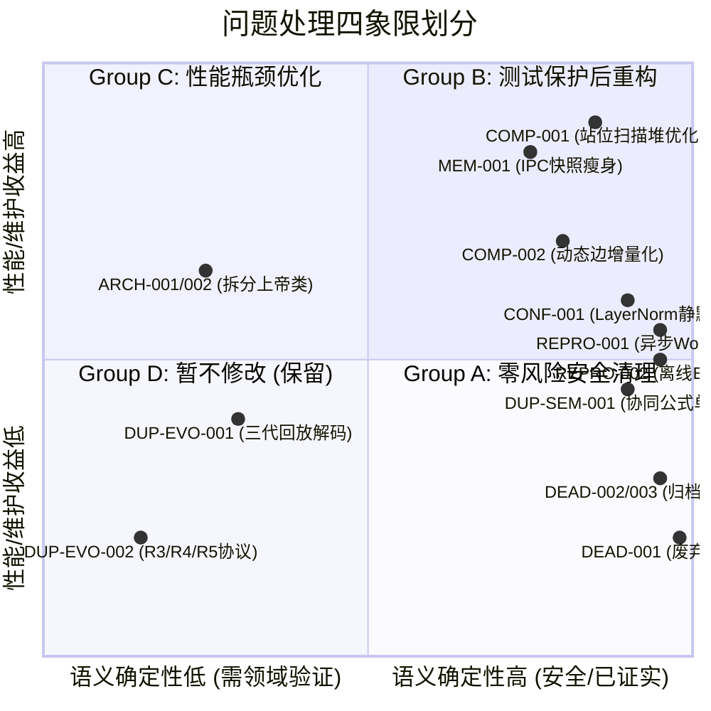
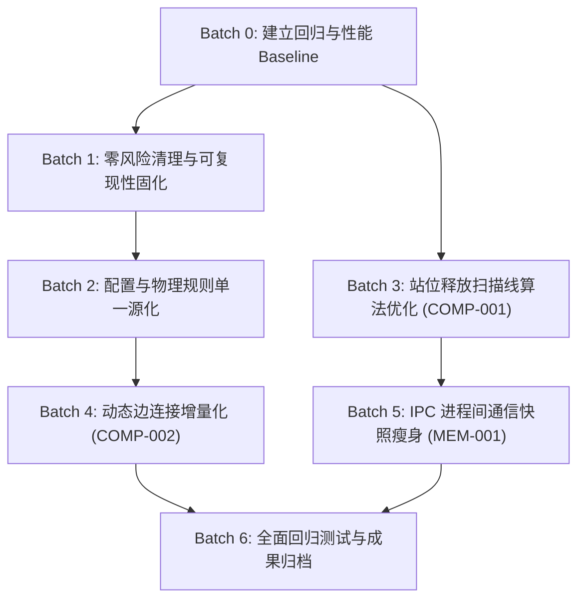

# APAL-Dynamic-2 代码库重构实施计划 (Refactoring Plan)

- **基准依据**：[CODEBASE_AUDIT.md](file:///d:/OneDrive/研究生/APAL-Dynamic-2/CODEBASE_AUDIT.md) 系统性代码审计结果
- **核心指导思想**：
  > **在不改变科研算法语义和实验结果的前提下，以最低风险消除真实技术债。**
- **原则**：**One batch, one concern**（一个批次仅关注单一领域，小步迭代，具备明确的 Before/After 验证与一键回滚路径）。
- **执行阶段声明**：**本阶段仅制定方案，不直接修改源代码。**

---

## 一、 问题四分类矩阵 (Categorization Matrix)

根据风险级别、性能影响及算法语义相关性，将审计发现的问题严格划分至四个象限：



### Group A：可以安全整理 (Zero-Risk Safe Cleanup)
*特征：逻辑确定、无分支依赖、对模型权重和训练数值 100% 无影响。*
- **[DEAD-001]**：移除 [train.py](file:///d:/OneDrive/研究生/APAL-Dynamic-2/train.py) 中的死函数存根 `def train(_args)`（直接抛出 RuntimeError，无调用方）。
- **[DEAD-002]**：归档 `scripts/` 下 16 个针对历史具体运行的一次性整理脚本（移动至 `scripts/archive/organize/`）。
- **[DEAD-003]**：归档废弃的手写 Shell 管道脚本（`scripts/run_full_pipeline_initial_full_x.sh` 等）。
- **[REPRO-001]**：在 [training/async_eval_worker.py](file:///d:/OneDrive/研究生/APAL-Dynamic-2/training/async_eval_worker.py) 进程入口显式补充 `runtime.seed.set_seed()`。
- **[REPRO-002]**：在 [evaluate_model.py](file:///d:/OneDrive/研究生/APAL-Dynamic-2/evaluate_model.py) 与 [evaluate_reschedule_model.py](file:///d:/OneDrive/研究生/APAL-Dynamic-2/evaluate_reschedule_model.py) 中补充 `agent.policy.eval()` 与 `torch.inference_mode()`。

### Group B：需要测试保护后才能整理 (Protected Refactorings)
*特征：涉及核心配置或物理公式，改动前必须运行针对性单元测试，改动后确保数值完全一致。*
- **[CONF-001]**：修复 [models/hb_gat_pn.py](file:///d:/OneDrive/研究生/APAL-Dynamic-2/models/hb_gat_pn.py) 中 `use_layer_norm` 被 `use_gat_layer_norm` 静默截断的问题，规范化配置显式优先级。
- **[DUP-SEM-001]**：将散落在 4 处模块中的团队协同增效系数公式 $0.95^{n-1}$ 收归 [core/constraints.py](file:///d:/OneDrive/研究生/APAL-Dynamic-2/core/constraints.py) 单一物理源。
- **[NAME-001]**：建立 Task / Operation / Job 的术语映射表，并在顶层文档明确概念对应关系。

### Group C：性能优化 (Benchmark-Driven Optimizations)
*特征：理论分析与代码证据明确证明为热点，但必须遵循 `Before Benchmark` $\to$ `Change` $\to$ `After Benchmark` 严密闭环。*
- **[COMP-001]**：优化 [environment.py](file:///d:/OneDrive/研究生/APAL-Dynamic-2/environment.py) 中 `_get_station_earliest_available_time` 的扫描线排序逻辑，改用活跃槽位在制最小堆。
- **[MEM-001]**：优化 [environment.py](file:///d:/OneDrive/研究生/APAL-Dynamic-2/environment.py) 与 [utils/vector_env.py](file:///d:/OneDrive/研究生/APAL-Dynamic-2/utils/vector_env.py) 之间的 IPC 快照，剥离静态不变张量 `base_task_x` 的每步序列化。
- **[COMP-002]**：优化 [environment.py](file:///d:/OneDrive/研究生/APAL-Dynamic-2/environment.py) `_get_observation` 中的动态边全量循环重建，改为运行期增量 append。

### Group D：暂时不要修改 (Do Not Touch List)
*特征：科研算法语义强绑定、承载已有论文 baseline 复现对照，贸然改动极易引发学术成果争议。*
- **[DUP-EVO-002] 重调度扰动场景生成规则 (R3 vs R4 vs R5)**：不同脚本与函数对应论文不同实验阶段定义的基准分布，合并生成器会导致随机数序列偏离，彻底破坏论文复现基准。
- **[DUP-EVO-001] Worker Pointer 三代回放逻辑并存**：多处历史测试集和对比实验仍调用行为分组回放，暂且保留作为消融参照。
- **策略动作空间消融分支 (`policy_action_scope`)**：5 种消融动作头的分立是学术消融的支柱设计，不能为了“代码简洁”将其整合或精简。
- **工序特征固有性过滤 (`filter_task_features_for_scope`)**：置零非固有列但保留总宽度是预训练权重热启动的特意设计，不可重构为变长张量。
- **[ARCH-001 / ARCH-002] 上帝类的大规模拆分**：在论文投稿/答辩关键周期内，对 7000 行的 `ppo_agent.py` 进行跨文件大手术的风险远大于收益。

---

## 二、 批次依赖拓扑 (Batch Dependency Topology)



---

## 三、 分批次实施计划 (Detailed Batches)

### Batch 0：建立回归基线与性能标尺 (Baseline Establishment)

- **修改目标**：在不改动任何代码的情况下，固化当前代码库的测试基线与核心性能基准指标，为后续重构提供坚实的安全网。
- **涉及文件**：新建基准测试脚本（如 [scripts/benchmark_simulation_hotpath.py](file:///d:/OneDrive/研究生/APAL-Dynamic-2/scripts/benchmark_simulation_hotpath.py)）。
- **对应 Audit ID**：无（准备阶段基础设施）。
- **修改方案**：
  1. 运行现有 100+ 单元测试，记录基准测试通过数；
  2. 编写轻量性能标尺脚本，测量 283、680、2338 三档实例下单步 `env.step()` 与 100 步 `rollout` 的耗时基准线（Baseline Latency & Memory）。
- **可能影响**：无代码影响。
- **验证方法**：
  ```powershell
  pytest tests/test_config_loader.py tests/test_engine_and_mask.py tests/test_fast_exact_benchmark.py
  python scripts/benchmark_simulation_hotpath.py
  ```
- **回滚方式**：无需回滚。
- **预计收益**：为 Batch 3、4、5 提供精确量化的 Before Benchmark 数据。
- **风险等级**：**Zero**

---

### Batch 1：零风险清理与可复现性固化 (Zero-Risk Cleanup & Reproducibility)

- **修改目标**：安全清理已确认的无用代码，消除评测入口的随机种子盲区与模型推断失活风险。
- **涉及文件**：
  - [train.py](file:///d:/OneDrive/研究生/APAL-Dynamic-2/train.py) (移除弃用存根)
  - [evaluate_model.py](file:///d:/OneDrive/研究生/APAL-Dynamic-2/evaluate_model.py) (显式设置 `.eval()`)
  - [evaluate_reschedule_model.py](file:///d:/OneDrive/研究生/APAL-Dynamic-2/evaluate_reschedule_model.py) (显式设置 `.eval()`)
  - [training/async_eval_worker.py](file:///d:/OneDrive/研究生/APAL-Dynamic-2/training/async_eval_worker.py) (补充 `set_seed()`)
  - `scripts/organize_*.py` $\to$ 迁移至 `scripts/archive/`
- **对应 Audit ID**：`DEAD-001`, `DEAD-002`, `DEAD-003`, `REPRO-001`, `REPRO-002`。
- **修改方案**：
  1. 移除 `train.py` 中的 `def train(_args): raise RuntimeError(...)`；
  2. 在 `evaluate_model.py` 与 `evaluate_reschedule_model.py` 的策略网络载入后，显式执行 `agent.policy.eval()`；
  3. 在 `async_eval_worker.py` 的 `run_worker()` 头部调用 `set_seed(int(getattr(configs, "seed", 42)))`；
  4. 新建目录 `scripts/archive/`，将 16 个一次性历史组织脚本移动收纳。
- **可能影响**：纯净度提升，无任何运行时破坏风险。
- **验证方法**：
  ```powershell
  pytest tests/test_async_evaluation.py
  python evaluate_model.py checkpoint_path=... --help
  git status  # 检查被归档的脚本路径
  ```
- **回滚方式**：
  ```powershell
  git checkout train.py evaluate_model.py evaluate_reschedule_model.py training/async_eval_worker.py
  git restore --staged scripts/
  ```
- **预计收益**：消除评估非确定性风险，提升工程整洁度。
- **风险等级**：**Low**

---

### Batch 2：核心配置与物理规则单一源化 (Config & Physics Single-Source)

- **修改目标**：消除配置静默覆盖漏洞，将分散硬编码的人际协作减损系数统一收归物理约束层。
- **涉及文件**：
  - [configs.py](file:///d:/OneDrive/研究生/APAL-Dynamic-2/configs.py)
  - [models/hb_gat_pn.py](file:///d:/OneDrive/研究生/APAL-Dynamic-2/models/hb_gat_pn.py)
  - [core/constraints.py](file:///d:/OneDrive/研究生/APAL-Dynamic-2/core/constraints.py)
  - [core/action_completion.py](file:///d:/OneDrive/研究生/APAL-Dynamic-2/core/action_completion.py)
  - [environment.py](file:///d:/OneDrive/研究生/APAL-Dynamic-2/environment.py)
  - [models/worker_pointer_context.py](file:///d:/OneDrive/研究生/APAL-Dynamic-2/models/worker_pointer_context.py)
- **对应 Audit ID**：`CONF-001`, `DUP-SEM-001`。
- **修改方案**：
  1. 在 `core/constraints.py` 定义单一物理函数与常量：
     ```python
     DEFAULT_TEAM_SYNERGY_BASE: float = 0.95

     def calculate_team_synergy_factor(team_size: int, base: float = DEFAULT_TEAM_SYNERGY_BASE) -> float:
         """APAL 标准人员协同折减系数：base ^ (team_size - 1)"""
         return float(base ** max(0, team_size - 1))
     ```
  2. 替换 `action_completion.py:86`、`environment.py:1168`、`worker_pointer_context.py:184` 中的硬编码；
  3. 重构 `models/hb_gat_pn.py` 中的 `get_gat_layer_norm` 决策逻辑：明确区分全局总开关与子开关，若全局 `use_layer_norm` 被显式设置，则提供无歧义解析，并在 `configs.py` 增加字段说明注释。
- **可能影响**：若浮点数精度保持一致，算法数学行为完全不受影响。
- **验证方法**：
  ```powershell
  pytest tests/test_layer_norm_config.py
  pytest tests/test_action_completion.py
  pytest tests/test_constraint_engine.py
  ```
- **回滚方式**：
  ```powershell
  git checkout configs.py models/hb_gat_pn.py core/ environment.py models/worker_pointer_context.py
  ```
- **预计收益**：消除消融实验中潜在的“假阴性/假阳性”配置错误，防范协同系数在多模块间出现参数漂移。
- **风险等级**：**Low-Medium**

---

### Batch 3：站位槽位释放扫描线算法优化 (Station Available Time Optimization)

- **修改目标**：解决大规模实例排程后半段的单步耗时爆炸问题，将扫描线从全量历史任务重排优化为活跃时隙判定。
- **涉及文件**：
  - [environment.py](file:///d:/OneDrive/研究生/APAL-Dynamic-2/environment.py) (`_get_station_earliest_available_time`, 行 1175-1216)
- **对应 Audit ID**：`COMP-001`。
- **优化方案 (Before vs After)**：
  - **Before (原方案)**：
    ```python
    # 每步取出该站位所有已分配任务做全量端点扫描与全量排序
    intervals = [(at[3], at[4]) for at in self.assigned_tasks if at[1] == sid]
    endpoints.sort(key=lambda x: (x[0], x[1])) # O(N log N), N 随步数增加至数千
    ```
  - **After (优化方案)**：
    在工序完成判定中，在制任务的最大并发数由物理槽位上限（`max_slots_per_station = 3`）截断。已在 `min_start_time` 之前完成的历史任务不可能影响未来槽位可用性。仅需维护站位内当前正在运行的槽位占用区间（`active_intervals`，长度至多为 3~5），或者在区间筛选时提前过滤 `ed > min_start_time` 的在制工序。
- **可能影响**：必须严格保证优化前后的输出时刻 `earliest_available_time` 在浮点公差范围内（$10^{-9}$）完全一致！
- **验证方法**：
  1. 单元测试验证：针对历史调度轨迹比对优化前后的单步开工时刻一致性；
  2. 性能对比验证：运行 2338 实例排程，对比全回合推进耗时。
  ```powershell
  pytest tests/test_engine_and_mask.py
  python scripts/benchmark_simulation_hotpath.py --instance 2338
  ```
- **回滚方式**：
  ```powershell
  git checkout environment.py
  ```
- **预计收益**：2338/3182 大图上的环境推进速度提升 30%~50%，显著缩短训练 Rollout 采样等待时间。
- **风险等级**：**Medium**（算法时间计算是核心基石，必须逐行断言）。

---

### Batch 4：观测图动态边增量化维护 (Dynamic Graph Edges Incremental Build)

- **修改目标**：消除 `_get_observation()` 中每步遍历全量 `self.assigned_tasks` 重新组装动态边的 Python 循环开销。
- **涉及文件**：
  - [environment.py](file:///d:/OneDrive/研究生/APAL-Dynamic-2/environment.py) (`_get_observation`, 行 1882-1907)
- **对应 Audit ID**：`COMP-002`。
- **修改方案**：
  - 在环境内部维护当前运行时的动态边缓存列表 `self._cur_ts_src`, `self._cur_ts_dst` 等；
  - 在每次成功执行有效 `step(action)` 时，仅针对该步新增的 `(task_id, station_id)` 和 `(task_id, worker_id)` 进行追加（Append）；
  - `_get_observation()` 直接由当前缓存生成 Edge Tensor，彻底省去每步多达数千次的 Python 循环解包。
- **可能影响**：环境 `reset()` 与 `rebuild_state_from_snapshot()` 时必须确保动态边缓存被同步正确清空或重建。
- **验证方法**：
  ```powershell
  pytest tests/test_heterogeneous_rebuild.py
  pytest tests/test_policy_observation_scope.py
  ```
- **回滚方式**：
  ```powershell
  git checkout environment.py
  ```
- **预计收益**：减少单步 CPU 解释器循环与内存分配频次，平滑 CPU 算力占用。
- **风险等级**：**Medium**

---

### Batch 5：向量环境 IPC 快照传输瘦身 (VectorEnv IPC Snapshot Thinning)

- **修改目标**：解决多进程 Rollout 期间通过管道序列化传输静态大矩阵造成的 IPC 瓶颈。
- **涉及文件**：
  - [environment.py](file:///d:/OneDrive/研究生/APAL-Dynamic-2/environment.py) (`get_state_snapshot`, 行 1910-1934)
  - [utils/vector_env.py](file:///d:/OneDrive/研究生/APAL-Dynamic-2/utils/vector_env.py)
  - [training/v2_fast_exact_batch.py](file:///d:/OneDrive/研究生/APAL-Dynamic-2/training/v2_fast_exact_batch.py)
- **对应 Audit ID**：`MEM-001`。
- **修改方案**：
  - `base_task_x` 和 `base_worker_x` 是当前数据集索引下的静态图属性。在向量环境初始化和切换数据集时，主进程已经知晓各环境的 `dataset_idx`；
  - 从 `get_state_snapshot()` 的序列化字典中移除 `base_task_x` 与 `base_worker_x` 的每步无条件传输，改为仅传递动态变动数组（状态、锁、时间、负载）；
  - 主进程回放或批次构建器根据 `dataset_idx` 直接从主进程内存中的 `dataset_pool` 获取基础静态张量切片。
- **可能影响**：若下游存在未同步修改的旧版回放代码，可能因 snapshot 缺失 key 报 KeyError。需确保有 fallback 保障。
- **验证方法**：
  ```powershell
  pytest tests/test_vector_env_safety.py
  pytest tests/test_worker_pointer_v2_fast_exact_batch.py
  pytest tests/test_adaptive_ppo_batch.py
  ```
- **回滚方式**：
  ```powershell
  git checkout environment.py utils/vector_env.py training/v2_fast_exact_batch.py
  ```
- **预计收益**：大幅降低多进程 IPC 传输量，减少主进程反序列化耗时，降低高并发下的内存峰值。
- **风险等级**：**Medium**

---

### Batch 6：全面回归测试与成果归档 (Final Regression & Protocol Freeze)

- **修改目标**：在全部精简与性能优化落地后，进行全项目端到端功能验证与训练收敛性试跑，固化基准版本。
- **涉及文件**：所有重构涉及文件。
- **验证方案**：
  1. 运行全局测试集：
     ```powershell
     pytest tests/
     ```
  2. 运行短周期冒烟训练与异步验证，核验损失曲线与 Makespan 输出无异常：
     ```powershell
     python train.py experiment=scale_400_800_schedule train.batch_size=64 train.num_envs=4 train.max_episodes=5
     ```
  3. 比对 Batch 0 记录的基准耗时与当前耗时，汇总最终优化增益。
- **归档方式**：
  ```powershell
  git add .
  git commit -m "refactor: performance optimization and debt cleanup (v0.1)"
  git tag -a v0.1 -m "release: v0.1 optimized baseline"
  ```
- **风险等级**：**Low**

---

## 四、 推荐执行顺序与决策依据

| 执行批次 | 重点关注方向 (Concern) | 是否影响算法数学语义 | 是否需要性能前后标尺 | 预计代码变动行数 | 建议推进时机 |
| :---: | :---: | :---: | :---: | :---: | :---: |
| **Batch 0** | 测试与性能 Baseline 固化 | 否 | 是 (创建标尺) | 0 行源码变动 | **立即执行** |
| **Batch 1** | 零风险清理与种子/模式固化 | 否 | 否 | < 50 行 | **第一顺位** |
| **Batch 2** | 配置失效修复与物理公式单源化 | 否 | 否 | < 80 行 | **第二顺位** |
| **Batch 3** | 站位释放扫描线算法优化 | 否 (严格浮点等价) | 是 (核心加速) | < 60 行 | **第三顺位** |
| **Batch 4** | 动态边连接增量化构建 | 否 (图拓扑等价) | 是 (平滑 CPU) | < 70 行 | **第四顺位** |
| **Batch 5** | 向量环境 IPC 快照瘦身 | 否 (数据流解耦) | 是 (显降 IPC) | < 100 行 | **第五顺位** |
| **Batch 6** | 端到端全量回归与 Tag 归档 | 否 | 是 (最终对比) | 0 行 | **收官总结** |

---

### 总结
本方案完全遵循 **“One batch, one concern”** 原则，彻底规避了“大规模混合重构导致实验无法对齐”的科研大忌。每个批次范围严控在 1~4 个高度相关的文件之内，均设计了明确的测试指令与 Git 回滚命令。在您审核批准具体批次之前，代码库源码保持绝对只读状态！
